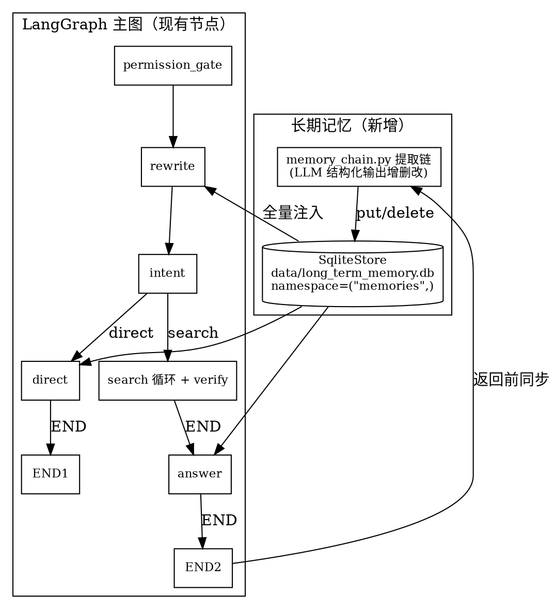

# 长期记忆系统设计（LangGraph Store：确定性事实自动提取 + 全量注入）

> 日期：2026-08-26 状态：已确认（方案 A——自建提取链 + 全量注入）
> 写入方式=LLM 自动提取；存储=LangGraph SqliteStore（跨重启持久化）；
> 消费点=rewrite+direct+answer；更新语义=提取时增删改；时机=同步提取；
> 前端=提供记忆管理页；隔离=全局单命名空间。

## 1. 背景与目标

短期记忆（MemorySaver Checkpointer）解决的是「同一会话内最近 3 轮的对话语境」
（指代消解、澄清承接），进程退出即清理。但有一类信息需要**跨会话恒定生效**：
用户在对话中表达过的**确定性事实**——例如「我是经理」「以后回答都用表格」
「回答要简洁」「我是餐饮部的」。这些不应随会话关闭而丢失。

本设计引入**长期记忆**：每轮问答结束前用一次 LLM 调用，从「本轮问答对 + 既有
记忆」中提炼确定性事实，以增删改操作写入持久化 `SqliteStore`；下一轮 invoke 时
把这些事实全量注入相关节点的 prompt，使回答持续贴合用户的身份、指令、输出格式
与偏好。

**与短期记忆的分工**（互补，不重叠）：

| 维度 | 短期记忆（已完成） | 长期记忆（本设计） |
| --- | --- | --- |
| 内容 | 最近 3 轮「问/答」+ 任务状态 | 恒定事实：角色/指令/输出格式/偏好 |
| 载体 | Checkpointer（MemorySaver，进程内存） | Store（SqliteStore，落 SQLite 文件） |
| 生命周期 | 进程退出即清理 | 跨重启持久化 |
| 消费点 | 仅 rewrite | rewrite + direct + answer |
| 写入 | 每轮 `update_state` 追加 | 每轮同步跑提取链，增删改 |

## 2. 关键决策（用户已确认）

| 决策点 | 选择 |
| --- | --- |
| 写入方式 | **LLM 自动提取**：每轮结束后台用一次 LLM 调用提炼确定性事实 |
| 存储后端 | **LangGraph SqliteStore**（`langgraph-checkpoint-sqlite`），落 SQLite 文件，跨重启保留 |
| 消费点 | 注入 **rewrite + direct + answer** 三个节点（指令/角色辅助 Query 理解，输出格式/偏好约束回答） |
| 更新语义 | **提取时增删改**：提取链输出结构化操作列表（create/update/delete），直接对 Store 执行 |
| 提取时机 | **同步提取**：`rag_chain_query` 返回前执行，保证下一轮必可见、测试确定 |
| 前端界面 | **提供记忆管理页**：列表 + 删除 + 可选手动新增 |
| 隔离维度 | **全局单命名空间** `("memories",)`；记忆不参与权限判定（权限仍由 X-Role 门禁控制） |

## 3. 架构总览

```
每轮问答：
  invoke 前（节点内按需读）:
    rewrite_node / direct_node / answer_node
        → read_memories(store)   全量读命名空间 → 拼成文本注入 prompt
  图正常执行（现有链路零改动）……
  invoke 后（rag_chain_query 收口）:
    _remember_turn（短期记忆，已有）
    _extract_memories（长期记忆，新增）:
        existing = read_memories(store)
        ops = memory_extractor(question, answer_snippet, existing)   # 1 次 LLM
        apply_memory_ops(store, ops)                                  # put/delete
```



**关键不变式**：
- 短期与长期记忆职责分离，互不覆盖。
- 记忆仅作 prompt 语境，**不参与权限判定**——`permission_gate` 仍只看 `X-Role`，无提权风险。
- Store 与编译图同为**进程级单例**；节点不捕获请求级资源（Store 是图级，非请求级，可闭包引用）。
- 提取失败**降级为不更新记忆**，绝不阻断问答返回。

## 4. 存储层（新增 `memory_store.py`）

**新文件** `backend/app/services/retrieval/memory_store.py`：

- **进程级单例**：模块级 `_STORE` 懒加载，`get_memory_store()` 首次调用时创建：
  ```python
  conn = sqlite3.connect(LTM_DB_PATH, check_same_thread=False, isolation_level=None)
  store = SqliteStore(conn); store.setup()
  ```
  与 `_GRAPH_CACHE` 同构（跨请求复用，非每请求重建）。
- **关键陷阱（已实测）**：连接必须 `isolation_level=None`（autocommit），否则
  SqliteStore 内部 `BEGIN` 与 Python 隐式事务冲突，抛
  `cannot start a transaction within a transaction`；`check_same_thread=False`
  兼容 FastAPI 同步多线程。
- **命名空间**：`NAMESPACE = ("memories",)`（tuple，全局单命名空间）。
- **测试注入口**：`set_memory_store(store)` 允许测试替换为
  `langgraph.store.memory.InMemoryStore`（零落盘、进程内），与短期记忆测试风格一致。
- **条目结构**（`store.put` 的 value，纯数据 dict，可序列化）：
  ```python
  {"content": "用户自称经理，偏好正式语气",
   "category": "role",           # role | instruction | format | preference
   "updated_at": "2026-08-26T10:00:00"}
  ```
  `key` 为稳定短标识（小写字母/数字/下划线，如 `user_role`、`answer_style`），
  由提取链在 create 时命名、在 update/delete 时引用既有 key。
- **读取辅助** `read_memories(store) -> list[dict]`：`store.search(NAMESPACE)`
  转 `[{key, content, category, updated_at}]`，按 `updated_at` 升序。
- **上限裁剪**：写入后条目数超 `MEMORY_MAX_ITEMS` 时，按 `updated_at` 删最旧。

## 5. 提取链（新增 `memory_chain.py`）

**新文件** `backend/app/services/retrieval/memory_chain.py`，与 `rewrite_chain.py` 同构。

**Schema**（`with_structured_output(method="function_calling")`，DeepSeek 不支持
json_schema）：
```python
class MemoryOp(BaseModel):
    op: Literal["create", "update", "delete"]
    key: str                                   # create 时新命名；update/delete 必须引用既有 key
    content: str | None = None                 # delete 时为 None
    category: Literal["role", "instruction", "format", "preference"] | None = None
    reason: str                                # 决策依据（便于前端展示/调试）

class MemoryUpdateResult(BaseModel):
    operations: list[MemoryOp] = []
```

**`build_memory_extractor(api_key, model=None)`** 返回
`extractor(question, answer, existing) -> MemoryUpdateResult`：
- 输入：本轮原始问题 + 本轮回答片段 + 既有记忆列表（`key: [category] content`）。
- prompt 要点：只提取**恒定、跨轮有效**的确定性事实；一次性/临时信息不记；
  与既有事实语义重复→忽略，演变/冲突→`update` 或 `delete`，全新→`create`；
  无值得记录的事实→返回空 `operations`。
- **失败降级**：捕获异常返回 `MemoryUpdateResult(operations=[])`，记 warning。

**`apply_memory_ops(store, ops)`**：
- 遍历操作：`create/update` → `store.put(NAMESPACE, key, value)`；
  `delete` → `store.delete(NAMESPACE, key)`（不存在则跳过）。
- 忽略非法操作（如 `update` 指向不存在的 key 时降级为 `create`）。
- 写入后调用上限裁剪（§4）。

## 6. 注入点改造（`agent_chain.py`）

三个消费点读取**全量记忆**并注入（确定性事实数量少，无需语义检索）：

- **`rewrite_node`**：`build_query_rewriter` 增加 `memories` 参数；
  `rewrite_chain.py` prompt 增「用户长期记忆（身份/指令/偏好）」段，无记忆时占位「（无）」。
- **`direct_node` / `answer_node`**：在 prompt 构造处注入记忆文本段
  （如 `长期记忆（用户身份/偏好，回答需遵守）:\n- [format] 用表格回答`），
  约束输出格式与风格。这两处目前是 `SYSTEM_PROMPT + human` 固定模板，
  改为在 human 段前追加记忆段（`SYSTEM_PROMPT` 常量保持不变）。
- **读取方式**：节点内调 `read_memories(get_memory_store())`——Store 为进程级
  单例（非请求级），可安全闭包引用，符合现有「节点不捕获请求级资源」原则
  （请求级的 `db` 仍走 RunnableConfig 注入）。
- **固定话术分支不受影响**：`permission_denied` / `refusal` / `clarify` /
  无命中分支在 `rag_chain_query` 内短路返回固定话术，不经过 `direct`/`answer`
  节点，故不受记忆注入影响（符合预期，固定话术不应被偏好改写）。
- **格式化**：`format_memories(memories) -> str`，每行 `- [category] content`；
  空列表返回「（无）」。

## 7. 提取时机与调用收口

- 所有返回分支在既有 `_remember_turn` 之后，统一调用新增 `_extract_memories(...)`：
  ```python
  def _extract_memories(api_key, model, question, resp):
      try:
          store = get_memory_store()
          existing = read_memories(store)
          extractor = build_memory_extractor(api_key, model=model)
          result = extractor(question, resp.answer[:_ANSWER_SNIPPET_LEN], existing)
          apply_memory_ops(store, result.operations)
      except Exception as e:
          logger.warning(f"长期记忆提取失败，跳过本轮: {e}")   # 不阻断返回
  ```
- `rag_chain_query` 需能拿到 `api_key` 以惰性构建提取链（与现有节点惰性构建一致）；
  现有签名已有 `api_key`，`model` 透传供测试 mock。
- **所有分支统一提取**（含 permission_denied/refusal）：被拒/澄清对话里用户仍可能
  表达偏好；`answer` 取固定话术或模型回答，长度用 `_ANSWER_SNIPPET_LEN` 截断。

## 8. API 与前端管理页

**后端**（新增，复用现有 `ApiResponse` / router 风格，字段全 `snake_case`）：
- **新文件** `backend/app/schemas/memory.py`：
  `MemoryItem {key, content, category, updated_at}`、
  `MemoryCreate {content, category="preference"}`（category 可选，默认 `preference`）。
- **新文件** `backend/app/routers/memory.py`（走 Store，不依赖 db）：
  - `GET /api/memories` → 列出全部 `MemoryItem`
  - `DELETE /api/memories/{key}` → 删除指定条目（不存在也返回成功）
  - `POST /api/memories` → 手动新增；**key 派生规则**：对 `content` 取
    `sha1` 前 12 位作为稳定 key（与提取链的语义 key 不冲突，且可幂等去重）
- `main.py` 注册 `memory.router`。

**前端**（与现有页面/风格一致）：
- **新文件** `frontend/src/api/memory.js`：`getMemories` / `deleteMemory` / `createMemory`。
- **新页面** `frontend/src/pages/Memory/index.jsx`：记忆列表（分类徽标 + 内容 + 更新时间 +
  删除按钮）+ 手动新增表单；沿用 `ErrorMessage`/`Loading` 组件。
- `App.jsx` 增 `<Route path="/memory" ...>`；`Navbar.jsx` 增「记忆」链接。

## 9. 错误处理与降级

| 场景 | 行为 |
| --- | --- |
| 提取链 LLM 异常/超时 | 记日志，本轮不更新记忆，问答照常返回 |
| `update` 指向不存在 key | 降级为 `create` |
| `delete` 指向不存在 key | 静默跳过 |
| Store 读取失败 | 注入段按「（无）」处理，不阻断 |
| 条目超上限 | 按 `updated_at` 删最旧 |

原则：**记忆是增强项，任何环节失败都静默降级，绝不影响主问答链路。**

## 10. 测试计划（TDD）

**新文件** `backend/tests/test_memory_chain.py`（`_mock_model` 的
`with_structured_output` 增加 `MemoryUpdateResult` schema 动态路由，与现有
rewrite/classify/slot 固定映射同构）：
- 提取链结构化输出正确解析为操作列表
- `apply_memory_ops` 增/删/改正确落 Store（用 `InMemoryStore`）
- 全量注入：带记忆时 `rewrite`/`direct`/`answer` prompt 含记忆文本；无记忆占位「（无）」
- 跨会话生效：A 会话建立记忆后，B 会话（新 `conversation_id`）仍注入
- 手动删除后下一轮不再注入
- 提取失败降级：提取链抛异常，问答正常返回
- 上限裁剪：超 `MEMORY_MAX_ITEMS` 时删最旧
- 回归：`py -m pytest tests/`（`USE_BGE_MODEL=false`，backend 目录）

## 11. 边界与成本

- 每轮 +1 次 LLM 调用（提取），+2 次 SQLite 读（注入）。确定性事实场景条目 <30，
  prompt 增量可控。
- 提取链为**同步**执行，问答响应延迟约 +1~3 秒（一次 DeepSeek 调用）。
- 存储独立文件 `data/long_term_memory.db`，与 `knowledge.db` 分离，不污染现有表。
- `SqliteStore` 连接进程内持有；重启后自动恢复（文件持久化）。

## 12. 关键实现陷阱（实测确认）

1. `SqliteStore(conn)` 的 `conn` 必须 `sqlite3.connect(..., check_same_thread=False,
   isolation_level=None)`，否则抛 `cannot start a transaction within a transaction`。
2. `SqliteStore.from_conn_string()` 返回**上下文管理器**，不适合进程级单例；
   应直接 `sqlite3.connect` 后传 `conn` 给 `SqliteStore(conn)`，并调用 `store.setup()`。
3. Store 的 value 必须是纯数据 `dict`（可 msgpack/json 序列化）。
4. 结构化输出必须 `method="function_calling"`（DeepSeek 不支持 json_schema）。
5. 依赖：`requirements.txt` 增 `langgraph-checkpoint-sqlite>=3.1.1`（已安装）。
